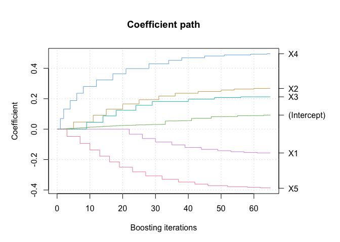

# boostCopula: Gradient-Boosted Estimation of Generalized Linear Models for Conditional Vine Copulas

<!-- badges: start -->

[](https://CRAN.R-project.org/package=boostCopula)
[](https://github.com/jobstdavid/boostCopula/actions)
[](https://github.com/jobstdavid/boostCopula)

<!-- badges: end -->

An R package performing gradient-boosting estimation of generalized
linear models (GLMs) for conditional vine copulas as described in the
references.

## Installation

You can install the development version from GitHub with:

``` r
# install.packages("remotes")
remotes::install_github("jobstdavid/boostCopula")
```

## Package overview

### Overview of the most important functions

- `boostBiCopEst`: This function estimates a GLM for a conditional
  bivariate copula via gradient-boosting. It returns an object of class
  `boostBiCop`.
- `boostBiCopSelect`: This function performs a gradient-boosted
  estimation of a GLM for conditional bivariate copulas including copula
  family selection. It returns an object of class `boostBiCop`.
- `boostBiCopPDF`, `boostBiCopCDF`: These function calculate the
  probability density function (PDF) or cumulative distribution function
  (CDF) of an `boostBiCop` object, respectively.
- `boostBiCopSim`: This function simulates samples from an `boostBiCop`
  object.
- `boostRVineSeqEst`: This function sequentially estimates the GLMs for
  conditional bivariate copulas of a d-dimensional conditional R-vine
  copula model via gradient-boosting. It returns an object of class
  `boostRVineCopula`.
- `boostRVineCopSelect`: This function sequentially estimates the GLMs
  for conditional bivariate copulas of a d-dimensional conditional
  R-vine copula model via gradient-boosting. Additionally, it selects
  the best fitting copula family. It returns an object of class
  `boostRVineCopula`.
- `boostRVineStructureSelect`: This function sequentially selects the
  regular vine tree structure as well as the conditional bivariate
  copulas via a gradient-boosted estimation of GLMs for a d-dimensional
  conditional R-vine copula model. It returns an object of class
  `boostRVineCopula`.
- `boostRVinePDF`: This function calculates the probability density
  function (PDF) of an `boostRVineCopula` object.
- `boostRVineSim`: This function simulates samples from an
  `boostRVineCopula` object.

### Overview of the implemented copula families

|                 Copula family                  | `family` |
|:----------------------------------------------:|:--------:|
|                    Gaussian                    |   `1`    |
|   Double Clayton I copula (0 and 90 degrees)   |  `301`   |
|  Double Clayton II copula (0 and 270 degrees)  |  `302`   |
| Double Clayton III copula (180 and 90 degrees) |  `303`   |
| Double Clayton IV copula (180 and 270 degrees) |  `304`   |
|   Double Gumbel I copula (0 and 90 degrees)    |  `401`   |
|  Double Gumbel II copula (0 and 270 degrees)   |  `402`   |
| Double Gumbel III copula (180 and 90 degrees)  |  `403`   |
| Double Gumbel IV copula (180 and 270 degrees)  |  `404`   |

## Example

### Load R-package and simulated data

``` r
# load package
library(boostCopula)

# load simulated data
data(data_bicop)
data(data_vinecop)
```

### Gradient-boosted estimation of a GLM for a conditional bivariate copula

``` r
# fit object
object <- boostBiCopEst(formula = ~.,
                        U = data_bicop[, 1:2],
                        X = data_bicop[, -c(1:2)],
                        family = 301,
                        control = boost_control(deselection = "attributable"))
summary(object)
#> Conditional bivariate copula: double Clayton I (301)
#> Non-zero coefficients:
#> (Intercept)           X1           X2           X3           X4           X5  
#>      0.0925      -0.1565       0.2675       0.2124       0.4953      -0.3883  
#> 
#> logLik: 499.804, AIC: -987.608, degrees of freedom: 6
#> Iterations: 65
plot(object)
```



### Gradient-boosted estimation of a GLM for conditional bivariate copulas including copula family selection

``` r
# fit object
object <- boostBiCopSelect(formula = ~.,
                           U = data_bicop[, 1:2],
                           X = data_bicop[, -c(1:2)],
                           familyset = NA,
                           control = boost_control(deselection = "attributable"))
summary(object)
#> Conditional bivariate copula: double Clayton I (301)
#> Non-zero coefficients:
#> (Intercept)           X1           X2           X3           X4           X5  
#>      0.0925      -0.1565       0.2675       0.2124       0.4953      -0.3883  
#> 
#> logLik: 499.804, AIC: -987.608, degrees of freedom: 6
#> Iterations: 65
```

### Sequential gradient-boosted estimation of GLMs for a conditional R-vine copula model

``` r
# create boostRVineMatrix
Matrix <- c(5, 0, 0, 0, 0,
            2, 2, 0, 0, 0,
            3, 3, 3, 0, 0,
            1, 4, 4, 4, 0,
            4, 1, 1, 1, 1)
Family <- c(0, 0, 0, 0, 0,
            404, 0, 0, 0, 0,
            1, 404, 0, 0, 0,
            401, 301, 304, 0, 0,
            1, 401, 304, 301, 0)
Matrix <- matrix(Matrix, 5, 5, byrow = TRUE)
Family <- matrix(Family, nrow = 5, ncol = 5, byrow = TRUE)
Formula <- matrix("~ .", 5, 5, byrow = TRUE)
boostRVM <- boostRVineMatrix(Matrix = Matrix,
                             family = Family,
                             formula = Formula)

# fit object
object <- boostRVineSeqEst(U = data_vinecop[, 1:5],
                           X = data_vinecop[, -c(1:5)],
                           boostRVM = boostRVM,
                           control = boost_control(deselection = "attributable"))
```

## Contact

Feel free to contact <jobstd@uni-hildesheim.de> if you have any
questions or suggestions.

## References

Jobst, D., Möller, A., and Groß, J. (2024). Gradient-Boosted Generalized
Linear Models for Conditional Vine Copulas. doi:.
